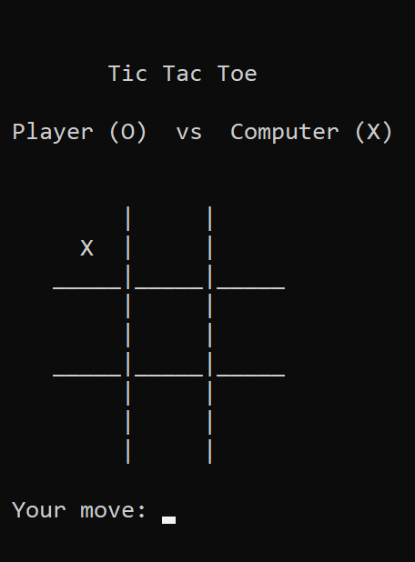
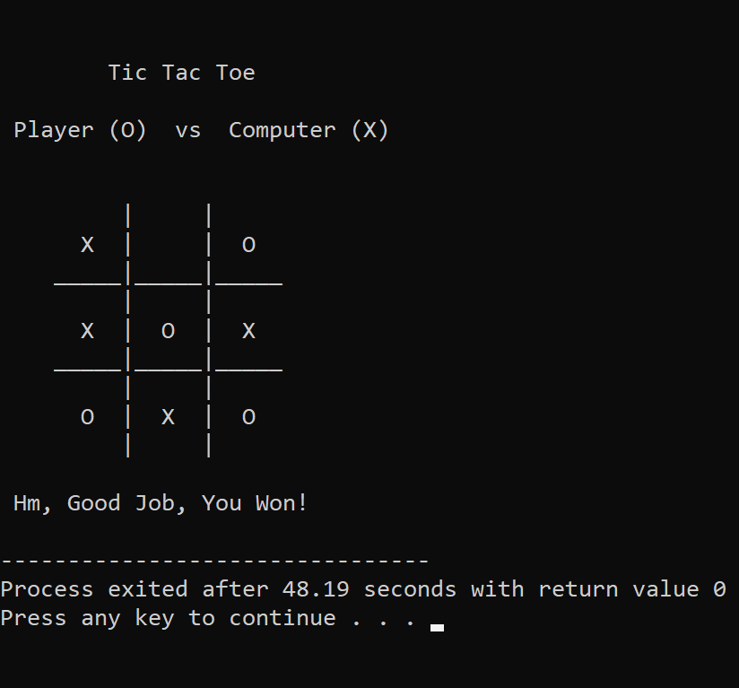

# Tic-Tac-Toe
Tic Tac Toe is a paper and pencil game for 2 people, in our case for 1 person and a computer. Each user has their own sign in this game, either “O” or “X”. Each user takes turn to mark 1 spot in 3x3 grid. The first user who will mark all three spots either vertically, horizontally, or diagonally wins the game.
Here is the implementation of this game using C language. The game is played by entering two integers that are separated by whitespace. First number represents a horizontal coordinate while the second numbers represents the vertical coordinate.

#
## Image 1

## Image 2

## Image 3

## Image 4

## Image 5

